# 🏃 Marathon Management Platform

<div align="center">


**A full-stack Marathon Management MVP built in a 1-day hackathon.**  
Manages the complete participant journey from registration to certified finisher — with a live race-day station and downloadable certificate.

</div>

---

## 📋 Table of Contents

- [Overview](#-overview)
- [Architecture](#-architecture)
- [5-Stage Participant Flow](#-5-stage-participant-flow)
- [Features](#-features)
- [Tech Stack](#-tech-stack)
- [Project Structure](#-project-structure)
- [Database Schema](#-database-schema)
- [Setup & Installation](#-setup--installation)
- [Demo Walkthrough](#-demo-walkthrough)
- [Team](#-team)

---

## 🎯 Overview

The Marathon Management Platform handles every stage of a race participant's lifecycle — from the moment they register online to the moment they cross the finish line and download their certificate.

Built as a **hackathon MVP** with a focus on:
- A working, demo-ready product over feature completeness
- Clean 5-stage state machine as the core business logic
- Minimal dependencies, maximum clarity

---

## 🏛️ Architecture

```
┌─────────────────────────────────────────────────────────────────┐
│                        BROWSER (Client)                          │
│                                                                   │
│   ┌─────────────┐   ┌──────────────────┐   ┌─────────────────┐  │
│   │  /register  │   │ /admin/login     │   │ /admin/race-day │  │
│   │  (Public)   │   │ (Auth Gate)      │   │ (BIB Station)   │  │
│   └──────┬──────┘   └────────┬─────────┘   └────────┬────────┘  │
│          │                   │                       │            │
│          │         ┌─────────▼─────────┐             │            │
│          │         │ /admin/participants│             │            │
│          │         │  (Dashboard)      │             │            │
│          │         └─────────┬─────────┘             │            │
└──────────┼───────────────────┼───────────────────────┼────────────┘
           │                   │                        │
           ▼                   ▼                        ▼
┌─────────────────────────────────────────────────────────────────┐
│                     Next.js 14 App Router                        │
│                                                                   │
│  ┌──────────────┐  ┌─────────────────┐  ┌───────────────────┐   │
│  │  Middleware  │  │ Server Components│  │ Client Components │   │
│  │  (Auth Guard)│  │ (Data Fetching) │  │ (Interactivity)   │   │
│  └──────┬───────┘  └────────┬────────┘  └─────────┬─────────┘   │
│         │                   │                      │              │
│         └───────────────────┼──────────────────────┘              │
│                             │                                     │
│                  ┌──────────▼──────────┐                         │
│                  │  @supabase/ssr       │                         │
│                  │  (Cookie-based Auth) │                         │
│                  └──────────┬──────────┘                         │
└─────────────────────────────┼───────────────────────────────────┘
                              │
                              ▼
┌─────────────────────────────────────────────────────────────────┐
│                         Supabase                                  │
│                                                                   │
│  ┌───────────────────┐        ┌──────────────────────────────┐   │
│  │  Supabase Auth    │        │  PostgreSQL Database          │   │
│  │                   │        │                              │   │
│  │  • Email/Password │        │  participants table          │   │
│  │  • JWT Sessions   │        │  • Row Level Security (RLS)  │   │
│  │  • Cookie SSR     │        │  • Status check constraints  │   │
│  └───────────────────┘        │  • Unique BIB enforcement    │   │
│                               └──────────────────────────────┘   │
└─────────────────────────────────────────────────────────────────┘
```

### Request Flow

```
Browser Request
      │
      ▼
┌─────────────┐     Not authenticated     ┌──────────────────┐
│  Middleware  │ ─────────────────────────▶│ Redirect /login  │
│  (Edge)     │                           └──────────────────┘
└──────┬──────┘
       │ Authenticated
       ▼
┌─────────────────┐
│  Server Component│  ◀── Reads cookies, fetches from Supabase
│  (Data Layer)   │
└────────┬────────┘
         │ Props
         ▼
┌─────────────────┐
│  Client Component│  ◀── User interactions, toast notifications
│  (UI Layer)     │       real-time updates via router.refresh()
└─────────────────┘
```

---

## 🔄 5-Stage Participant Flow

```mermaid
stateDiagram-v2
    direction LR

    [*] --> registered : Participant submits\npublic form

    registered --> confirmed : Admin clicks\n"Approve + BIB"\n(auto-assigns BIB #)

    confirmed --> bib_collected : Race Day Station\nenters BIB number

    bib_collected --> certified : Race Day Station\nenters BIB number again\n(marks as finisher)

    certified --> [*] : Certificate\ngenerated & downloaded

    style registered fill:#9CA3AF,color:#fff
    style confirmed fill:#3B82F6,color:#fff
    style bib_collected fill:#F59E0B,color:#fff
    style certified fill:#10B981,color:#fff
```



| Stage | Status | Triggered By | Description |
|---|---|---|---|
| 1 | `registered` | Participant | Self-registers via public form |
| 2 | `confirmed` | Admin | Approves + assigns BIB number (auto-confirmed) |
| 3 | `bib_collected` | Race Official | Enters BIB at race-day station |
| 4 | `certified` | Race Official | Enters BIB again → marks as finisher |
| 5 | Certificate | System | Client-side PNG generated and downloaded |

---

## ✨ Features

### 👤 Participant Portal (Public)
- **Self-registration** — no account needed
- Form captures: Name, Email, Phone, Age, T-shirt size
- Duplicate email prevention (Supabase unique constraint)
- Instant toast feedback

### 🛡️ Admin Dashboard
- **Secure login** via Supabase Auth (email + password)
- **Participant table** — sortable, searchable by name, email or BIB
- **Approve + BIB** — one click assigns next available BIB and confirms the participant
- **Colour-coded status badges** for at-a-glance status monitoring
- Protected by both Edge Middleware and Server Component auth checks

### 🏁 Race Day Station
- **Dedicated `/admin/race-day` page** optimised for fast check-in
- Large BIB number input (auto-focused, numeric keyboard on mobile)
- Smart action based on current status:
  - `confirmed` → marks **BIB Collected**
  - `bib_collected` → marks **Certified** + shows certificate
- Error toasts for unknown BIBs or wrong status

### 🏅 Certificate Generation
- Fully **client-side** — no server, no PDF library
- Rendered as styled HTML/CSS in the browser
- **html2canvas** captures it as a high-res PNG
- Fallback to `window.print()` if canvas capture fails
- Certificate includes: participant name, BIB number, race name, completion date

### 🔔 Notifications
- **react-hot-toast** for all status changes
- No email/SMS dependencies — works offline

---

## 🛠️ Tech Stack

| Layer | Technology | Purpose |
|---|---|---|
| Framework | Next.js 14 (App Router) | SSR, routing, middleware |
| Language | TypeScript | Type safety |
| Styling | Tailwind CSS v3 | Utility-first UI |
| Database | Supabase (PostgreSQL) | Data persistence + RLS |
| Auth | Supabase Auth | Admin login, JWT sessions |
| SSR Auth | @supabase/ssr | Cookie-based auth for Next.js |
| Toasts | react-hot-toast | In-app notifications |
| Certificate | html2canvas | Client-side PNG export |
| Deployment | Vercel-compatible | Zero-config deploy |

---

## 📁 Project Structure

```
marathon-app/
│
├── src/
│   ├── app/
│   │   ├── page.tsx                          # → redirects to /register
│   │   ├── layout.tsx                        # Root layout + Toaster
│   │   ├── globals.css                       # Tailwind directives
│   │   │
│   │   ├── register/
│   │   │   └── page.tsx                      # 🌐 Public registration form
│   │   │
│   │   ├── admin/
│   │   │   ├── login/
│   │   │   │   └── page.tsx                  # 🔐 Admin login page
│   │   │   │
│   │   │   └── (protected)/                  # Route group (auth-guarded)
│   │   │       ├── layout.tsx                # Nav bar + server auth check
│   │   │       ├── page.tsx                  # → redirects to /participants
│   │   │       ├── participants/
│   │   │       │   └── page.tsx              # 📋 Participant management table
│   │   │       └── race-day/
│   │   │           └── page.tsx              # 🏁 Race day BIB station
│   │   │
│   │   └── api/auth/callback/
│   │       └── route.ts                      # Supabase auth callback
│   │
│   ├── components/
│   │   ├── ParticipantTable.tsx              # Filterable table + approve action
│   │   ├── BibScanner.tsx                    # BIB input → status transitions
│   │   ├── Certificate.tsx                   # Certificate render + download
│   │   ├── StatusBadge.tsx                   # Colour-coded status pill
│   │   └── SignOutButton.tsx                 # Client-side sign out
│   │
│   ├── lib/
│   │   ├── supabase/
│   │   │   ├── client.ts                     # Browser Supabase client
│   │   │   └── server.ts                     # Server Supabase client (SSR)
│   │   └── types.ts                          # Participant + ParticipantStatus types
│   │
│   └── middleware.ts                         # Edge auth guard for /admin/*
│
├── supabase/
│   └── migrations/
│       └── 001_initial_schema.sql            # participants table + RLS policies
│
├── test-demo-flow.mjs                        # E2E demo flow test script
├── .env.local.example                        # Environment variable template
├── next.config.js
├── tailwind.config.ts
└── tsconfig.json
```

---

## 🗄️ Database Schema

### `participants` table

```sql
Column          Type            Description
─────────────── ─────────────── ──────────────────────────────────────
id              uuid            Primary key (auto-generated)
created_at      timestamptz     Registration timestamp
name            text            Full name (required)
email           text            Unique email (required)
phone           text            Phone number (optional)
age             integer         Age (optional)
tshirt_size     text            S / M / L / XL
status          text            registered | confirmed |
                                bib_collected | certified
bib_number      integer         Unique BIB (null until admin assigns)
certified_at    timestamptz     Set when participant is certified
```

### Row Level Security (RLS)

```
┌─────────────────────────────────────────────────────┐
│  Role: anon (public)                                 │
│  Permission: INSERT only                             │
│  Condition: status = 'registered', bib_number IS NULL│
└─────────────────────────────────────────────────────┘

┌─────────────────────────────────────────────────────┐
│  Role: authenticated (admin)                         │
│  Permission: SELECT, INSERT, UPDATE, DELETE (ALL)    │
│  Condition: none (full access)                       │
└─────────────────────────────────────────────────────┘
```

---

## 🚀 Setup & Installation

### Prerequisites
- Node.js 18+
- A [Supabase](https://supabase.com) project (free tier is enough)

### 1. Clone the repository

```bash
git clone https://github.com/Rajnish-Snaatak/Marathon.git
cd Marathon
```

### 2. Install dependencies

```bash
npm install
```

### 3. Configure environment variables

```bash
cp .env.local.example .env.local
```

Edit `.env.local`:

```env
NEXT_PUBLIC_SUPABASE_URL=https://your-project.supabase.co
NEXT_PUBLIC_SUPABASE_ANON_KEY=your-anon-key
NEXT_PUBLIC_RACE_NAME=City Marathon 2026
```

> Find these in your Supabase project: **Settings → API**

### 4. Run the database migration

In **Supabase Dashboard → SQL Editor**, paste and run:

```sql
-- contents of supabase/migrations/001_initial_schema.sql
```

### 5. Create an admin user

In **Supabase Dashboard → Authentication → Users → Add User**:
- Email: your admin email
- Password: strong password
- ✅ Auto Confirm User

### 6. Start the development server

```bash
npm run dev
```

Open **http://localhost:3000** — you'll be redirected to `/register`.

---

## 🎬 Demo Walkthrough

Follow these steps to see the full flow in action:

```
Step 1 ── Open http://localhost:3000/register
         Fill in Name, Email, T-Shirt size → click Register Now
         ✅ Toast: "Registered! Check in on race day with your BIB number."

Step 2 ── Open http://localhost:3000/admin/login
         Sign in with your admin credentials
         ✅ Redirected to Participants dashboard

Step 3 ── Find your participant in the table (status: Registered)
         Click "Approve + BIB"
         ✅ Toast: "BIB #1001 assigned — [Name] confirmed"
         ✅ Status badge turns blue: Confirmed

Step 4 ── Click "Race Day" in the nav
         Enter BIB number: 1001 → click Confirm BIB
         ✅ Toast: "✅ BIB #1001 collected — [Name]"
         ✅ Status badge turns yellow: BIB Collected

Step 5 ── Enter BIB number: 1001 again → click Confirm BIB
         ✅ Toast: "🏅 [Name] is certified!"
         ✅ Certificate card appears on screen

Step 6 ── Click "⬇ Download PNG"
         ✅ certificate-bib-1001.png downloaded
```

### Run the automated test

```bash
ADMIN_EMAIL=your@email.com ADMIN_PASSWORD=yourpassword node test-demo-flow.mjs
```

---

## 👥 Team

| Name | Role |
|---|---|
| **Rajnish Sharma** | Full Stack Developer |
| **Shrey Tyagi** | Full Stack Developer |
| **Abhay** | Full Stack Developer |

---

<div align="center">

Built with ❤️ at a 1-day Hackathon · Powered by [Next.js](https://nextjs.org) + [Supabase](https://supabase.com)

</div>
