# 🏃 Marathon Management Platform

<div align="center">


### 🌐 [Live Demo → marathon-app-weld.vercel.app](https://marathon-app-weld.vercel.app)

**A full-stack Marathon Management Platform built in a 1-day hackathon.**
Manages the complete participant journey from event discovery to certified finisher — with a public event landing page, self-service status tracker, admin dashboard, live race-day station, and downloadable completion certificate.

</div>

---

## 📋 Table of Contents

- [Overview](#-overview)
- [Architecture](#-architecture)
- [5-Stage Participant Flow](#-5-stage-participant-flow)
- [Features](#-features)
- [Tech Stack](#-tech-stack)
- [Project Structure](#-project-structure)
- [Database Schema](#-database-schema)
- [Setup & Installation](#-setup--installation)
- [Demo Walkthrough](#-demo-walkthrough)
- [Team](#-team)

---

## 🎯 Overview

The Marathon Management Platform handles every stage of a race participant's lifecycle — from the moment they discover the event to the moment they cross the finish line and download their certificate.

Built as a **hackathon MVP** with a focus on:
- A working, demo-ready product over feature completeness
- Clean 5-stage state machine as the core business logic
- Fully public participant self-service (no participant login required)
- Minimal dependencies, maximum clarity

---

## 🏛️ Architecture

```
┌──────────────────────────────────────────────────────────────────────┐
│                          PUBLIC ROUTES                                │
│                                                                        │
│  ┌──────────┐  ┌────────────┐  ┌──────────┐  ┌────────────────────┐ │
│  │    /     │  │ /register  │  │ /status  │  │ /confirm → /status │ │
│  │ Landing  │  │ Sign Up    │  │ Tracker  │  │ (redirect)         │ │
│  └──────────┘  └────────────┘  └──────────┘  └────────────────────┘ │
└──────────────────────────────────────────────────────────────────────┘
                                    │
┌──────────────────────────────────────────────────────────────────────┐
│                         ADMIN ROUTES (protected)                      │
│                                                                        │
│  ┌────────────────┐  ┌──────────────────────┐  ┌─────────────────┐  │
│  │ /admin/login   │  │ /admin/participants   │  │ /admin/race-day │  │
│  │ Auth Gate      │  │ Dashboard            │  │ BIB Station     │  │
│  └────────────────┘  └──────────────────────┘  └─────────────────┘  │
└──────────────────────────────────────────────────────────────────────┘
                                    │
┌──────────────────────────────────────────────────────────────────────┐
│                       Next.js 14 App Router                           │
│                                                                        │
│   Edge Middleware (auth guard)  →  Server Components (data fetch)    │
│                                 →  Client Components (interaction)   │
│                                 →  @supabase/ssr (cookie auth)       │
└──────────────────────────────────────────────────────────────────────┘
                                    │
┌──────────────────────────────────────────────────────────────────────┐
│                             Supabase                                   │
│                                                                        │
│   Supabase Auth (JWT/cookie)    PostgreSQL + Row Level Security       │
│   • Admin email+password        • participants table                  │
│   • Anon key for public routes  • Status check constraints            │
│                                 • Per-role RLS policies               │
└──────────────────────────────────────────────────────────────────────┘
```

---

## 🔄 5-Stage Participant Flow

```mermaid
stateDiagram-v2
    direction LR

    [*] --> registered    : Participant submits\npublic /register form

    registered --> approved    : Admin clicks\n"Approve + BIB"\n(assigns BIB number)

    approved --> confirmed     : Participant visits\n/status and clicks\n"Confirm My Participation"

    confirmed --> bib_collected : Race Day Station\nenters BIB number

    bib_collected --> certified : Race Day Station\nenters BIB again\n(marks as finisher)

    certified --> [*] : Certificate generated\n& downloaded

    style registered    fill:#9CA3AF,color:#fff
    style approved      fill:#F97316,color:#fff
    style confirmed     fill:#3B82F6,color:#fff
    style bib_collected fill:#F59E0B,color:#fff
    style certified     fill:#10B981,color:#fff
```



| # | Status | Badge | Triggered By | Description |
|---|---|---|---|---|
| 1 | `registered` | ⬜ Grey | Participant | Self-registers via public `/register` form |
| 2 | `approved` | 🟠 Orange | Admin | Approves + assigns unique BIB number |
| 3 | `confirmed` | 🔵 Blue | Participant | Confirms via `/status` page (self-service) |
| 4 | `bib_collected` | 🟡 Yellow | Race Official | BIB entered at race-day station |
| 5 | `certified` | 🟢 Green | Race Official | Marked as finisher → certificate shown |

---

## ✨ Features

### 🌐 Public Event Landing Page (`/`)
- **Event details** — name, date (June 1, 2026), time, location
- **Distance categories** — 5K, 10K, Half Marathon (21.1 km), Full Marathon (42.2 km)
- **FAQ section** — registration deadlines, fees, transfers, race day tips
- **Sponsor tiers** — Platinum / Gold / Silver display
- Sticky nav with direct links to Register and Track Status
- Static server component — zero client JS, instant load

### 👤 Participant Registration (`/register`)
- **Public self-registration** — no account needed
- Form: Name, Email, Phone, Age, T-shirt size (S/M/L/XL)
- Duplicate email prevention via Supabase unique constraint
- Toast feedback on success or error

### 📍 Participant Status Tracker (`/status`)
- **Lookup by email or BIB number** — no login required
- **5-stage visual progress tracker** — desktop horizontal + mobile vertical
- BIB number shown once participant reaches `approved`
- **"Confirm My Participation"** button — self-service `approved → confirmed` transition
- **Certificate + download** shown inline when `certified` (reuses Certificate component)
- Hints for pending/confirmed states

### 🛡️ Admin Dashboard (`/admin/participants`)
- Secure login via Supabase Auth (email + password)
- Searchable/filterable participant table (name, email, BIB)
- **Approve + BIB** — assigns next BIB number, sets status to `approved`
- Colour-coded status badges for all 5 stages
- Protected by Edge Middleware + Server Component double-check

### 🏁 Race Day Station (`/admin/race-day`)
- Dedicated page optimised for fast check-in
- Large BIB number input — auto-focused, numeric keyboard on mobile
- Smart action based on current status:
  - `confirmed` → marks **BIB Collected**
  - `bib_collected` → marks **Certified** + shows certificate
  - `approved` → error: "ask participant to confirm via /status"
- Error toasts for unknown BIBs or wrong status

### 🏅 Certificate Generation
- Fully **client-side** — no server, no PDF library
- Rendered as styled HTML/CSS in the browser
- **html2canvas** captures it as high-res PNG download
- Fallback to `window.print()` if canvas fails
- Content: participant name, BIB number, race name, completion date

### 🔔 Notifications
- **react-hot-toast** for all status changes and errors
- No email/SMS dependencies — works fully offline

---

## 🛠️ Tech Stack

| Layer | Technology | Purpose |
|---|---|---|
| Framework | Next.js 14 (App Router) | SSR, routing, edge middleware |
| Language | TypeScript | End-to-end type safety |
| Styling | Tailwind CSS v3 | Utility-first responsive UI |
| Database | Supabase (PostgreSQL) | Data persistence + RLS |
| Auth | Supabase Auth | Admin login, JWT sessions |
| SSR Auth | @supabase/ssr | Cookie-based auth for Next.js |
| Toasts | react-hot-toast | In-app notifications |
| Certificate | html2canvas | Client-side PNG export |
| Deployment | Vercel | Zero-config production deploy |

---

## 📁 Project Structure

```
marathon-app/
│
├── src/
│   ├── app/
│   │   ├── page.tsx                          # 🌐 Event landing page
│   │   ├── layout.tsx                        # Root layout + Toaster
│   │   ├── globals.css                       # Tailwind directives
│   │   │
│   │   ├── register/
│   │   │   └── page.tsx                      # 📝 Public registration form
│   │   │
│   │   ├── status/
│   │   │   └── page.tsx                      # 📍 Participant status tracker
│   │   │
│   │   ├── confirm/
│   │   │   └── page.tsx                      # → redirects to /status
│   │   │
│   │   ├── admin/
│   │   │   ├── login/
│   │   │   │   └── page.tsx                  # 🔐 Admin login
│   │   │   └── (protected)/                  # Route group (auth-guarded)
│   │   │       ├── layout.tsx                # Nav bar + server auth check
│   │   │       ├── page.tsx                  # → redirects to /participants
│   │   │       ├── participants/
│   │   │       │   └── page.tsx              # 📋 Participant management table
│   │   │       └── race-day/
│   │   │           └── page.tsx              # 🏁 Race day BIB station
│   │   │
│   │   └── api/auth/callback/
│   │       └── route.ts                      # Supabase auth callback
│   │
│   ├── components/
│   │   ├── ParticipantTable.tsx              # Filterable table + approve action
│   │   ├── BibScanner.tsx                    # BIB input → 5-stage transitions
│   │   ├── Certificate.tsx                   # Certificate render + PNG download
│   │   ├── StatusBadge.tsx                   # Colour-coded status pill (5 states)
│   │   └── SignOutButton.tsx                 # Client-side sign out
│   │
│   ├── lib/
│   │   ├── supabase/
│   │   │   ├── client.ts                     # Browser Supabase client
│   │   │   └── server.ts                     # Server Supabase client (SSR)
│   │   └── types.ts                          # Participant + ParticipantStatus types
│   │
│   └── middleware.ts                         # Edge auth guard for /admin/*
│
├── supabase/
│   └── migrations/
│       ├── 001_initial_schema.sql            # participants table + base RLS
│       └── 002_status_page_rls.sql           # anon SELECT + self-confirm UPDATE
│
├── test-demo-flow.mjs                        # E2E demo flow test script
├── .env.local.example                        # Environment variable template
├── next.config.js
├── tailwind.config.ts
└── tsconfig.json
```

---

## 🗄️ Database Schema

### `participants` table

```sql
Column          Type            Description
─────────────── ─────────────── ──────────────────────────────────────────────
id              uuid            Primary key (auto-generated)
created_at      timestamptz     Registration timestamp
name            text            Full name (required)
email           text            Unique email (required)
phone           text            Phone number (optional)
age             integer         Age (optional)
tshirt_size     text            S / M / L / XL
status          text            registered | approved | confirmed |
                                bib_collected | certified
bib_number      integer         Unique BIB (null until admin assigns)
approved_at     timestamptz     Set when admin approves
confirmed_at    timestamptz     Set when participant self-confirms
certified_at    timestamptz     Set when certified at finish line
```

### Row Level Security (RLS)

```
┌───────────────────────────────────────────────────────────┐
│  Role: anon (public)                                       │
│  INSERT  — status='registered', bib_number IS NULL         │
│  SELECT  — all rows (for status page lookup)               │
│  UPDATE  — only approved→confirmed transition              │
└───────────────────────────────────────────────────────────┘

┌───────────────────────────────────────────────────────────┐
│  Role: authenticated (admin)                               │
│  ALL operations — full unrestricted access                 │
└───────────────────────────────────────────────────────────┘
```

---

## 🚀 Setup & Installation

### Prerequisites
- Node.js 18+
- A [Supabase](https://supabase.com) project (free tier is sufficient)

### 1. Clone the repository

```bash
git clone https://github.com/Rajnish-Snaatak/Marathon.git
cd Marathon
```

### 2. Install dependencies

```bash
npm install
```

### 3. Configure environment variables

```bash
cp .env.local.example .env.local
```

Edit `.env.local`:

```env
NEXT_PUBLIC_SUPABASE_URL=https://your-project.supabase.co
NEXT_PUBLIC_SUPABASE_ANON_KEY=your-anon-key
NEXT_PUBLIC_RACE_NAME=City Marathon 2026
```

> Find these in your Supabase project: **Settings → API**

### 4. Run database migrations

In **Supabase Dashboard → SQL Editor**, run both migrations in order:

```bash
# Migration 1 — core schema
supabase/migrations/001_initial_schema.sql

# Migration 2 — RLS for public status page
supabase/migrations/002_status_page_rls.sql
```

### 5. Create an admin user

In **Supabase Dashboard → Authentication → Users → Add User**:
- Email: your admin email
- Password: strong password
- ✅ Auto Confirm User

### 6. Start the development server

```bash
npm run dev
```

Open **http://localhost:3000** — the event landing page loads.

---

## 🎬 Demo Walkthrough

The full 5-stage journey from discovery to certificate:

```
Step 1 ── Visit http://localhost:3000
         Browse the event landing page (distances, FAQ, sponsors)
         Click "Register Now" → taken to /register

Step 2 ── Fill in Name, Email, T-Shirt → click Register Now
         ✅ Toast: "Registered! Check in on race day with your BIB number."
         Status: registered (grey)

Step 3 ── Admin: go to /admin/login, sign in
         Find participant in table → click "Approve + BIB"
         ✅ Toast: "BIB #1001 assigned — [Name] approved"
         Status: approved (orange) · BIB now visible

Step 4 ── Participant: visit /status, enter email or BIB
         5-stage tracker shown with current stage highlighted
         Click "✅ Confirm My Participation"
         ✅ Toast: "You're confirmed! See you on race day 🎉"
         Status: confirmed (blue)

Step 5 ── Race Day: admin goes to /admin/race-day
         Enter BIB 1001 → click Confirm BIB
         ✅ Toast: "✅ BIB #1001 collected — [Name]"
         Status: bib_collected (yellow)

Step 6 ── Enter BIB 1001 again → click Confirm BIB
         ✅ Toast: "🏅 [Name] is certified!"
         Status: certified (green) · Certificate shown

Step 7 ── Click "⬇ Download PNG" on the certificate
         ✅ certificate-bib-1001.png downloaded

Step 8 ── Participant: revisit /status with email or BIB
         Certificate shown inline with download button
```

### Run the automated E2E test

```bash
ADMIN_EMAIL=your@email.com ADMIN_PASSWORD=yourpassword node test-demo-flow.mjs
```

---

## 👥 Team

| Name | Role |
|---|---|
| **Rajnish Sharma** | Full Stack Developer |
| **Shrey Tyagi** | Full Stack Developer |
| **Abhay** | Full Stack Developer |

---

<div align="center">

Built with ❤️ at a 1-day Hackathon · Powered by [Next.js](https://nextjs.org) + [Supabase](https://supabase.com)

</div>
