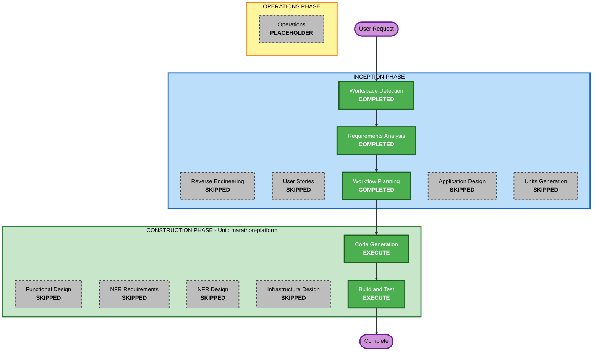

# Execution Plan — Marathon Management Platform MVP

## Analysis Summary

### Change Impact Assessment
- **User-facing changes**: Yes — public registration form, admin dashboard, race-day station, certificate download
- **Structural changes**: Yes — new Next.js App Router project from scratch
- **Data model changes**: Yes — `participants` table with 5-stage status field
- **API changes**: Yes — Supabase client calls (no custom REST API layer needed)
- **NFR impact**: No — security and PBT extensions disabled for hackathon prototype

### Risk Assessment
- **Risk Level**: Low
- **Rollback Complexity**: Easy (greenfield — nothing to break)
- **Testing Complexity**: Simple (manual demo verification)

---

## Workflow Visualization



### Text Alternative

```
INCEPTION PHASE:
  [COMPLETED] Workspace Detection
  [SKIPPED]   Reverse Engineering
  [COMPLETED] Requirements Analysis
  [SKIPPED]   User Stories
  [COMPLETED] Workflow Planning
  [SKIPPED]   Application Design
  [SKIPPED]   Units Generation

CONSTRUCTION PHASE (Unit: marathon-platform):
  [SKIPPED]   Functional Design
  [SKIPPED]   NFR Requirements
  [SKIPPED]   NFR Design
  [SKIPPED]   Infrastructure Design
  [EXECUTE]   Code Generation  <-- NEXT
  [EXECUTE]   Build and Test

OPERATIONS PHASE:
  [PLACEHOLDER] Operations
```

---

## Phases to Execute

### INCEPTION PHASE
- [x] Workspace Detection — COMPLETED
- [x] Reverse Engineering — SKIPPED (Greenfield)
- [x] Requirements Analysis — COMPLETED
- [x] User Stories — SKIPPED (single admin persona, no complex acceptance criteria, hackathon pace)
- [x] Workflow Planning — COMPLETED
- [x] Application Design — SKIPPED (components self-evident from requirements; saving hackathon time)
- [x] Units Generation — SKIPPED (single Next.js monolith = single unit "marathon-platform")

### CONSTRUCTION PHASE — Unit: `marathon-platform`
- [x] Functional Design — SKIPPED (data model + state machine fully specified in requirements.md; CG planning step covers design)
- [x] NFR Requirements — SKIPPED (security extension disabled Q6:B; no other NFRs for hackathon)
- [x] NFR Design — SKIPPED (NFR Requirements skipped)
- [x] Infrastructure Design — SKIPPED (Supabase handles DB/auth infra; Vercel-compatible by default with Next.js)
- [ ] Code Generation — EXECUTE (always; includes Part 1 Planning + Part 2 Generation)
- [ ] Build and Test — EXECUTE (always)

### OPERATIONS PHASE
- [ ] Operations — PLACEHOLDER

---

## Unit Definition: `marathon-platform`

**Type**: Single Next.js monolith (App Router)
**Deployment**: Single Vercel/local process + Supabase backend

**Responsibilities**:
- Public participant self-registration form
- Supabase schema (participants table + RLS)
- Admin authentication (Supabase Auth)
- Admin participant management dashboard (approve, assign BIB, view status)
- Race-day station UI (BIB number input → mark bib_collected → mark certified)
- Client-side certificate generation + download

**Target Project Structure**:
```
marathon-app/
├── src/
│   ├── app/
│   │   ├── page.tsx                     (redirect)
│   │   ├── layout.tsx
│   │   ├── register/page.tsx            (public registration)
│   │   ├── admin/
│   │   │   ├── layout.tsx               (auth guard)
│   │   │   ├── page.tsx                 (dashboard redirect)
│   │   │   ├── login/page.tsx
│   │   │   ├── participants/page.tsx    (participant table)
│   │   │   └── race-day/page.tsx        (BIB scan station)
│   │   └── api/auth/callback/route.ts   (Supabase auth callback)
│   ├── components/
│   │   ├── ParticipantTable.tsx
│   │   ├── BibScanner.tsx
│   │   ├── Certificate.tsx
│   │   └── StatusBadge.tsx
│   ├── lib/
│   │   ├── supabase/client.ts
│   │   ├── supabase/server.ts
│   │   └── types.ts
│   └── middleware.ts
├── supabase/migrations/001_initial_schema.sql
├── public/
├── package.json
├── next.config.ts
├── tailwind.config.ts
├── tsconfig.json
└── .env.local.example
```

---

## Estimated Timeline
- **Total Stages Remaining**: 2 (Code Generation + Build and Test)
- **Estimated Duration**: 3–5 hours of generation + review for hackathon demo

## Success Criteria
- **Primary Goal**: Working demo of 5-stage participant flow
- **Key Deliverables**:
  - Public registration form → creates participant with `registered` status
  - Admin login + dashboard showing all participants with status badges
  - Approve action assigns BIB → auto-sets `confirmed`
  - Race-day BIB input → marks `bib_collected`
  - Second BIB input → marks `certified` + certificate download
- **Quality Gates**: App runs locally (`npm run dev`) with no console errors on happy path
